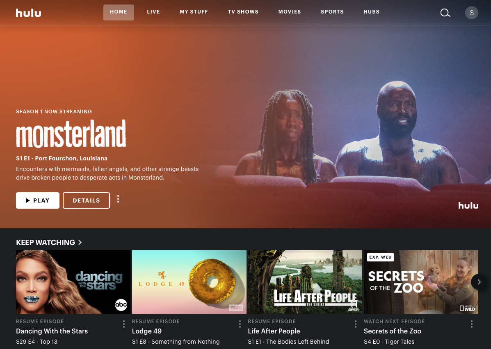
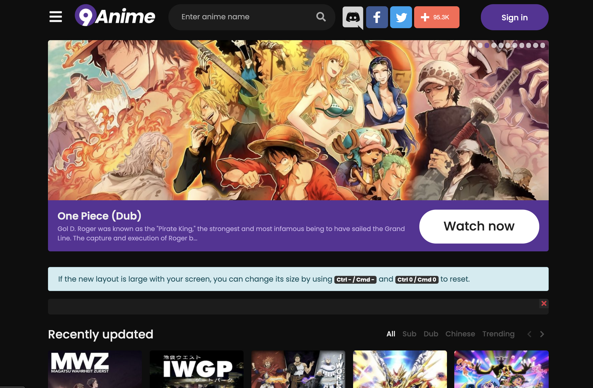

# Streaming Platforms Variability
DH150: User Experience and Design Assignment 01

## Hulu
https://www.hulu.com/

Hulu is a streaming platform that provides a varity of shows, movies and Live television to its users. Hulu is customizable, kid friendly and requires a subscription. Overall Hulu provides a lot of great shows and has a great aesthetic, but I have had multiple issues with the platform not working on my app or my desktop and has left me discoruaged from using it. 

## 9Anime 
https://www12.9anime.to/

9Anime is a streaming service that provides a multitude of anime shows and movies. This platform unsactioned which leads to many hiccup, however it functions well and provides the users with basic necessities.

## Analysis
#### 1. VISIBILITY OF SYSTEM STATUS
Visibility of system status is how well the app/web gives feedback about its progress of downloading/uploading/etc. Since I am analyzing streaming services, this heuristic would be demonstrated as a loading icon for the videos streaming capacity. 

9anime shows its loading status by an animated dial and a grey bar along the videos timeline. Having both these icons demonstrate whether or not there is no connection or if connection is just slow. The dial will spin before the video plays, if it continues to spin I know my wifi is down or I have no connection. The grey bar on the time shows the loading speed, so I may have slow connection but the video will play. The dial is in the middle of the screen and  is animated which gives me a sense of progress. It could spin for an hour but I would feel as if the program is “thinking” or solving the problem. **(1)**

Hulu has a loading icon that appears on the screen of the center. The icon is animated, giving a sense of ease as well. I have had issues where the video will begin to play but the icon will not disappear. Since the icon is in the middle of the screen it completely draws the attention if the video continues to play. Hulu doesn't have a loading progress bar on the timeline, however this is not critical. **(2)**

#### 2. MATCH BETWEEN SYSTEM AND THE REAL WORLD
Match between the system and the real world are critical to navigating a site. This heuristics draws from knowledge we have of the real world to understand how the site works.
9anime doesn’t use particularly unique language when describing its features. The home button takes you back to where you started, the magnifying glass signifies a search option, and the schedule button shows a calendar of release dates. (1)
Hulu has more unique ways of describing their features but still draw from real world experiences. There's a home button to navigate you back to where you started, a my stuff button that has a personalized list of programs that the user would like and lastly there is a hubs button. Hubs on hulu are categories of shows or movies that have similarities, however this differs from genres. The only problem with a button like this is that the user may not be looking for these specific categories so this may be useless to them. (1)

#### 3. USER CONTROL AND FREEDOM
User control and freedom is the users ability to navigate easily and “go back” when they take a misstep. 
9anime doesn't have an obvious back button, more often than not you would need to use your laptop's back button or resort to pressing the home button. The search bar is very obvious so if the user is looking for something specific they can easily retype what they are looking for. This site does not have a very good browsing option. (2)
Hulu has very obvious back buttons and escape options. The arrows and x’s appear in obvious locations, such as the top right or left hand corners. Unlike 9anime, when the user selects something in Hulu it often takes up the entire screen so there needs to be an obvious escape if they accidentally misclick or change their minds. For streaming services it is unlikely that the user will make a misstep that will need to be “undone”. (1)

#### 4. CONSISTENCY AND STANDARDS
Consistency and standards is essentially sticking to what works. The user needs to be comfortable with what they are looking at so familiar icons and locations will be used so the cognitive load is lightened on the user.
All navigation options are at the top of the screen. The signin is at the top right corner, the search bar is at the top in the middle and the navigation menu is top left, hidden in a hamburger icon. If someone just started to use this site they would have all the tools but it would be easier on the cognitive load if the navigation menu was listed on the homepage. The site assumes that the user already knows what they are looking for and doesn’t give the user obvious browsing options. However, the site uses a very bland and obvious up/down scroll option, which gives a level of clarity but makes the options feel overwhelmingly endless. **(1)**
Hulu follows the same conventional navigation options, with all the tools listed at the top of the screen. Visually, Hulu has a better display, emphasizing images over words. Hulu also displays your progress on a show or movie. Sideways scrolling is the main way to display more options, which has become more popular and easier to understand but when this style was first adopted it was confusing on which way to scroll. Both sites very obviously display a play button when hovering over one of their selections. Since it is a streaming platform it is excellent there is no confusion on how to start watching a program. (1)

#### 5. ERROR PREVENTION
Error prevention is a way to prevent the user from making a mistake with consequences, often through pop up menus.
The most serious mistake a user can make on a streaming platform is logging out or deleting their account. Logging out or accidentally exiting a show results in no pop up windows, however it would result in user irritation if every time they exited a show a window popped up. To cancel a subscription results in a pop up menu and requires verification, however I don’t think this is for the user because it is very simple to resubscribe. In conclusion, streaming platforms don’t require much error prevention. (1)

#### 6. RECOGNITION RATHER THAN RECALL
Recognition rather than recall is giving the user suggestions or cues of what to choose based on previous searches or interests. 
9nime gives no user suggestions specific to users previous searches. The site has a banner on the home screen that displays popular shows and recently uploaded. 9anime rarely remembers or saves my progress on any show. This results in a lot of effort from the user to remember their interest and where they left off. (3)
Hulu suggests popular shows as well as compiles a list of programs that best fit your taste. These suggestions are one of the first things the user sees when they access Hulu. The site also puts a “keep watching list” at the top and “watch again” section on the first page. Hulu remembers what you have watched and suggests more shows based on that. (1)

#### 7. FLEXIBILITY AND EFFICIENCY OF USE
Flexibility and efficiency of use refers to a user's navigation tendencies and how the site can be better catered to users of carrying experience. This is a fine balance between providing enough information to guide a new user but not overwhelm them, while giving an experienced user options to expand and alter.
User flexibility on 9anime is pretty much the same for users with varying levels of experience. The site is image heavy, so the type and name of each show is very obvious. When the user goes to select a show a play button pops up and a brief description appears. Beyond play, plause and fast forward there are no other options to altering one's experience of the site or show. The site is one single scroll so the user is bombarded with a lot of options even if they search a single show. I wouldn’t say any of these characters are negative because they provide the user with all the information they need, but don’t provide any special services. (2) 
Hulu provides more speciality options for advanced users while still providing ease for novice users. Like 9anime hulu is image driven but provides no new information when hovered over. Although the screen is not crowded it would be tedious for a user to continuous click and exit each show that they are interested in. Hulu does provide like/dislike buttons to help the algorithm and even has a recording button for die hard watchers. (1)

#### 8. AESTHETIC AND MINIMALIST DESIGN
Aesthetic and minimalist design implies that the usability of the site trumps any decorative details. The site needs to be clean and clear, with visible navigation and problem solving. 
9anime’s overall aesthetic is minimal, simple colors with bold text. The design of the structure of the site is clean and clear but the listing of the shows is cluttered and compact. The descriptions slack hierarchy and sometimes the dark text blends in with the dark background. This site has questionable color choices, but the features that are important to using this site are clear and bold so overall it could be worse. (2)
Hulu does a good job of creating hierarchy among its text and images. The images follow a clear pattern but change shape making it easier to distinguish between rows and columns. There is a clear distinction between what is in the background and the foreground. The color palette is clear and concise, not overpowering on the eyes. (1)

#### 9. HELP USERS RECOGNIZE, DIAGNOSE, AND RECOVER FROM ERRORS
Good user experience explicitly states errors while making the recovery process as easy as possible. This could include a friendly message  or clear directions of how to fix the problem. 
9anime will display an error but no obvious explanation of what the error is. On this site, shows are being constantly uploaded and taken down so most of the time that's where the problem occurs. However, with no knowledge of the site this may become very frustrating to new users, but at least it doesn’t sit on a loading page giving the user false hope. (2)
Hulu could do a better job of notifying the user of errors. I have had network problems and the screen just stays black or the play button becomes unpressable. Most streaming sites display an error and a way to navigate out of it but hulu does not. The errors and inability to figure out a way around them is what makes hulu so difficult to use. On occasion the whole site will collapse and will not run, with no direction about how to solve it. (3!)

#### 10. HELP AND DOCUMENTATION
Help and documentation is how easily a user can find help when a problem occurs.
9anime’s help and contact are found at the bottom of the page which is consistent with other sites. However, help is fairly small and limited, which gives the user the idea that help isn’t reliable. (1)
Hulu’s help option is at the bottom of the screen which is a fairly long scroll to get down to. The help button is small but it does lead the user to an entire help desk with a variety of pre answered questions. (2)
